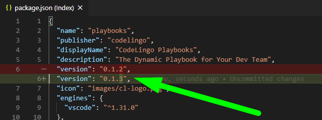
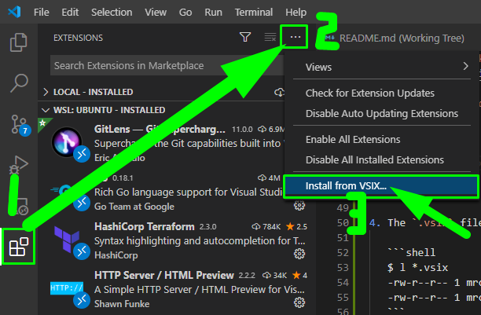

# CodeLingo Notebook VS Code Extension

## Prerequisites

The following toolchain must be installed on each developer's machine:

| What                    | Version   | Why                                    |
| ----------------------- | --------- | -------------------------------------- |
| linux (or wsl2) + shell |           | Scripts use linux-like syntax          |
| yarn                    | `^1.22.*` | Main package manager                   |
| npm                     | `^6.*.*`  | Package manager for firebase functions |
| vscode                  | `^1.50.*` | Automatic script running etc           |

## Initial Setup

### Additional Prerequisites

1. See [_Initial Setup_ section in the workspace README.md](../README.md#initial-setup) for details on installing TypeScript, Firebase and Webpack CLI tools.

2. Install `vsce` CLI:

   ```bash
   sudo npm i --global vsce
   ```

## Running locally

1. Press `F5` or choose `Start Debugging` command from the command palette.

1. The extension host window will start up.

1. Breakpoints can be set in the TypeScript files and these will trigger the debugger.

1. If you already have the extension installed as a VSIX (or from Marketplace), then extension host will temporarily overlap it while debugging.

## Deployment to VSIX

1. Increment the `version` field in `vscode/package.json`:

   

2. In terminal, `cd` into `vscode` folder

3. Run:

   ```bash
   vsce package --yarn
   ```

4. The `.vsix` file will be created in the `vscode` folder:

   ```shell
   $ l *.vsix
   -rw-r--r-- 1 mrcrowl mrcrowl 393K Nov 15 11:37 notebooks-0.1.2.vsix
   -rw-r--r-- 1 mrcrowl mrcrowl 394K Nov 15 11:48 notebooks-0.1.3.vsix
   ```

## Installation of VSIX

1. In the Extensions side-tab, choose the `⋯` menu and then `Install from VSIX....`

   

2. Choose the `.vsix` file and reload.

## Deployment to VS Code Marketplace

... TBD
